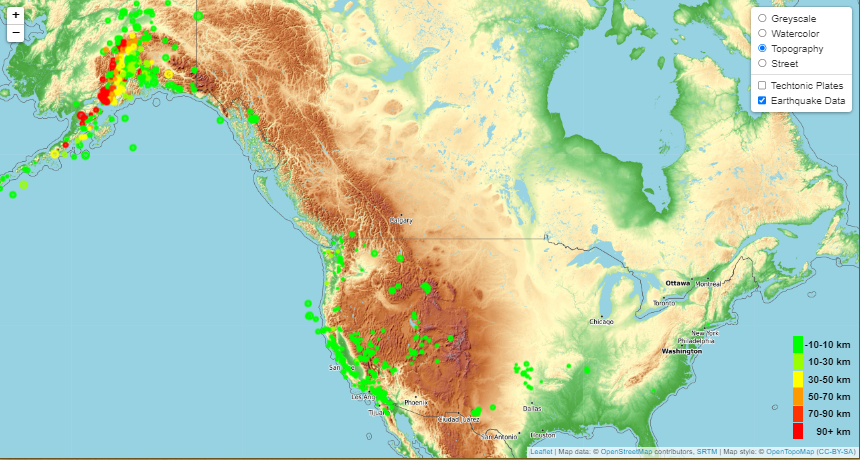

# Module 15 Leaflet Challenge
## Summary

Viewing belly button bacteria data is informative but, visualizing that data gives a perspective of diversity and scale that viewing data can not. In this challenge I built an interactive web page that allows viewers to easily visualizing belly button bacteria data.  
- Visit the final form here:  https://sajeanpage.github.io/module_14_belly_button_challenge/

# 
- The site contains:
  - interactive maps of the US and World
  - several styles choices of visual map layers 
  - selectable overlays of earthquake data and tectonic plate boundaries
  - responsive popup marker of earthquake facts
  - a color coded legend of earthquake magnitudes
 
- Key technologies include:
  - BootStrap js library
  - D3 js library  
  - Javascript
  - Leaflet
  - CSS
  

- References
  - USGS, U.S. Geological Survey. (2022). Past 7 Days All Earthquakes. Retrieved from https://earthquake.usgs.gov/earthquakes/feed/v1.0/geojson.php
  - Hugo Ahlenius, Github Tectonic Plates GeoJson. (October 2, 2014). PB2002_boundaries data. Retrieved from https://raw.githubusercontent.com/fraxen/tectonicplates/master/GeoJSON/PB2002_boundaries.json
